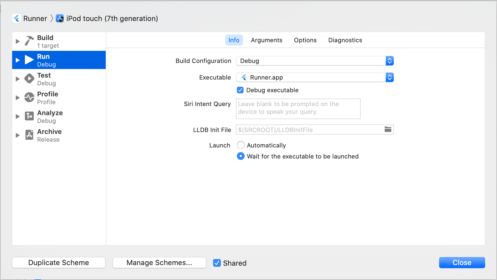
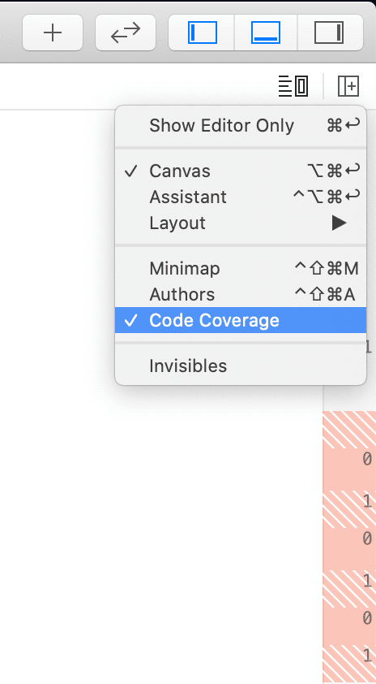

# Xcode-tips
play with Xcode

[TOC]

## 代码提示与检测
- [Xcode展示自定义warnings](https://jerrychu.github.io/2018/08/05/Xcode-warnings/)
- [Xcode重复代码检测](https://jerrychu.github.io/2018/08/05/Xcode-cpd/)

## 命令行工具
- scheme 跳转
  ```shell
  xcrun simctl openurl booted myapp://
  ```
  
- 清理 DeriveData
  ```shell
  alias makeXcodeGreatAgain='rm -rf ~/Library/Developer/Xcode/DerivedData/*'
  ```

- 命令行快速打开 Xcode 工程
  ```shell
  xed .
  ```
## 调试

- 低版本 Xcode 调试高系统版本设备
  ```shell
  # 以Xcode10 beta5 / iOS12 beta5为例
  ln -s /Applications/Xcode-beta.app/Contents/Developer/Platforms/iPhoneOS.platform/DeviceSupport/12.0\ \(16A5339e\)      /Applications/Xcode.app/Contents/Developer/Platforms/iPhoneOS.platform/DeviceSupport
  ```
- 断点调试命令（debugger command）
  ```shell
  # 修改变量值
  expression i = 1
  
  # 直接return
  thread return
  
  # 跳过1行/跳到指定行
  thread jump -b 1 
  thread jump 111
  ```

- scheme 冷启动调试 

  正常情况下，在 Xcode 中运行 APP 时会自动拉起 APP ，无法调试 scheme 拉起 APP 冷启动的情况。  
  
  可以通过修改工程配置，让 Xcode 不自动拉起 APP ，而是等待 APP 被其他行为拉起（比如主动点击 APP Icon，或者通过 scheme 拉起）。

  修改方式：
  - 进入设置页 Product -> Scheme -> Edit Scheme
  - 查看 Run - Info - Launch 
  - 选择 *Wait for the executable to be launched*

    

  修改后，在 Xcode 中运行 APP 时就不会主动拉起 APP 了。  
  继续在命令行中执行下面的命令，就能够愉快地调试 scheme 拉起逻辑了！

  ```shell
  xcrun simctl openurl booted myapp://
  ```

## 快捷键

- 在左侧的Project Navigator中定位当前文件（Reveal in Project Navigator）

`Command+Shift+J`

- 切换.m/.h文件

`Control+Command+⬆️⬇️`

- 编辑所有匹配项

`Control+Command+E`

## 单元测试

- 命令行执行单元测试
  ```shell
  # 使用xcodeproj
  xcodebuild test -project Demo/Demo.xcodeproj -scheme Demo -destination 'platform=iOS Simulator,name=iPhone 11' -resultBundlePath test.xcresult

  # 使用xcworkspace
  xcodebuild test -workspace Demo/Demo.xcworkspace -scheme Demo -destination 'platform=iOS Simulator,name=iPhone 11' -resultBundlePath test.xcresult
  ```

- 解析单元测试覆盖率
  ```
  xcrun xccov view --report --json test.xcresult > result.json
  ```

- Xcode展示代码是否被单元测试覆盖  
  红色表示该行未被单元测试覆盖，数字表示执行次数
 
  
